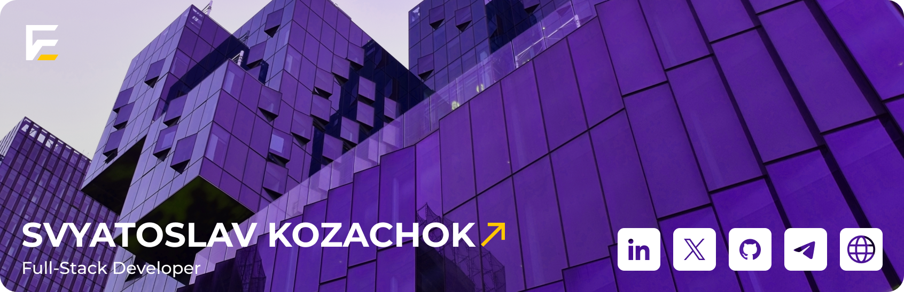

[**[Hire A Talent](https://tally.so/r/3lldZB)**]
[**[Request A Quote](https://tally.so/r/3lldZB)**]
[**[Find A Jobs](https://tally.so/r/3j9Qza)**] \_\_\_
[**[For Companies](https://tally.so/r/3lldZB)**]
[**[For Developers](https://tally.so/r/3j9Qza)**]

[**[Chat With Me](https://www.linkedin.com/in/%D1%81%D0%B2%D1%8F%D1%82%D0%BE%D1%81%D0%BB%D0%B0%D0%B2-%D0%BA%D0%BE%D0%B7%D0%B0%D1%87%D0%BE%D0%BA-7483451ba//)**]
[**[Work With Me](https://www.linkedin.com/in/%D1%81%D0%B2%D1%8F%D1%82%D0%BE%D1%81%D0%BB%D0%B0%D0%B2-%D0%BA%D0%BE%D0%B7%D0%B0%D1%87%D0%BE%D0%BA-7483451ba/)**]

# 💫 About Me:
 👋 Hey there! I’m Svyatoslav, a full-stack developer dedicated to bringing innovative tech ideas to life.  🔭 Right now, I'm focused on building a cutting-edge freelance platform to connect top tech talent with dynamic opportunities.  👯 Always excited to team up on projects that make a real-world impact and drive innovation.  🤝 Reach out if you need a hand with backend tuning or complex API integrations.  🌱 Currently diving into new JavaScript frameworks.  💬 Let’s talk about full-stack development! 

## 🌐 Socials:
 

# 💻 Tech Stack:
                    
# 📊 GitHub Stats:
 
 

### ✍️ Random Dev Quote

### 🔝 Top Contributed Repo

---

<!-- Proudly created with GPRM ( https://gprm.itsvg.in ) -->
